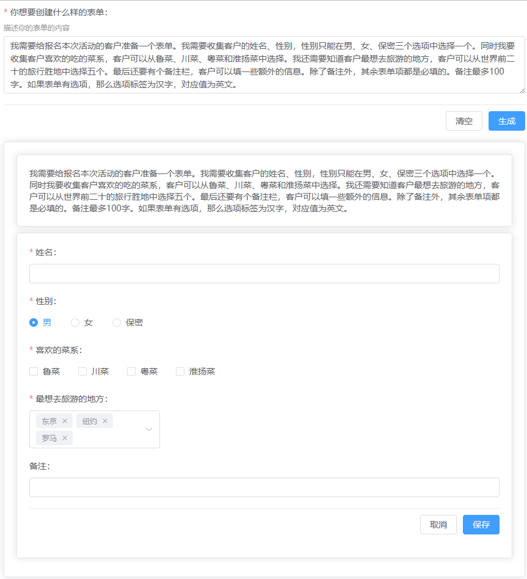
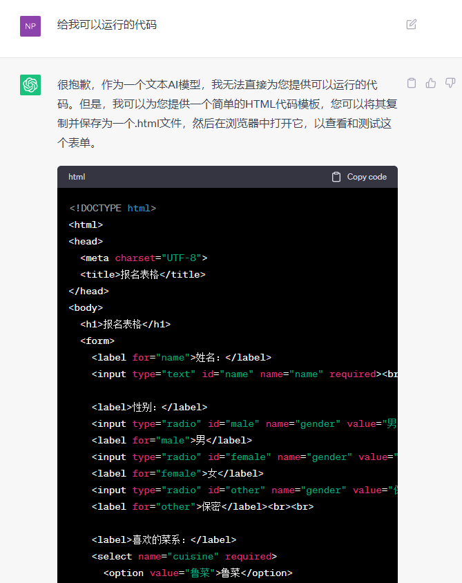
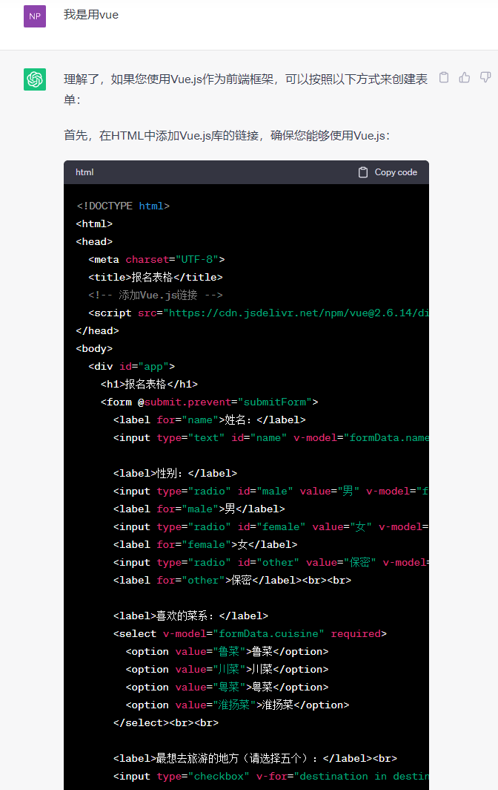

# form-typechat 
借助typechat来利用LLM模型用自然语言构建表单

## 实现思路

### 背景

7月21日的时候，[Anders Hejlsberg](https://twitter.com/ahejlsberg)宣布了新的项目宣布了全新的开源项目 —— [TypeChat](https://microsoft.github.io/TypeChat/blog/introducing-typechat/)。
当时的推文[链接](https://twitter.com/ahejlsberg/status/1682068311415341057?s=20)

中文自媒体关于此事的[相关信息](https://zhuanlan.zhihu.com/p/645084158)

通过运行TypeChat提供的几个[示例](https://microsoft.github.io/TypeChat/docs/examples/)，可以发现，借助TypeChat这种方式，可以很好的控制像ChatGPT这类LLM的输出结果。将模型输出的结果转换成了可使用程序进一步处理的数据。

在上半年ChatGPT大火的时候，虽然LLM模型解决了让程序理解自然语言的这个最大的难题，但由于LLM模型输出的还是自然语言，这就让我们对模型输出的结果进行进一步处理时候遇到了困难，因此这几个月出现的大量Prompt工程和Prompt工程师*^____^*

而TypeChat出现，无疑也是解决这个问题的一个思路，我们可以看到，利用typechat这种方式可以更容易控制模型的输出结果。本项目就是尝试借助typechat来利用LLM模型用自然语言构建表单。

### 具体实现
在[FormSchema.ts](packages/form-typechat/src/FormSchema.ts)中，我定义了几种简单的表单的数据结构，包括输入框、单选框、多选框和下拉选择框。

在[server包内](packages/server/src/app.ts)，使用Express构建一个服务，实现了一个接口，调用TypeChat生成结果。

在[front-end内](packages/front-end/src/App.vue)，使用vite初始化了一个vue3项目，利用[Vue JSON Schema Form](https://vue-json-schema-form.lljj.me/),将模型返回结果渲染成表单。

## 本地运行

### 克隆项目
```bash
git clone https://github.com/yilihjy/form-typechat.git
```

### 配置环境变量

在项目跟目录，创建`.env`文件
```env
OPENAI_ENDPOINT='https://api.openai.com/v1/chat/completions'
OPENAI_API_KEY='你的OPENAI的key'
OPENAI_MODEL='gpt-3.5-turbo-16k'
```
如果你没有直接使用openai的服务，而是使用一些转发服务，比如我使用[api2d](https://api2d.com/r/186772)的接口转发服务
我的`OPENAI_ENDPOINT`填写的就是`https://openai.api2d.net/v1/chat/completions`，`OPENAI_API_KEY`填的就是我在[api2d](https://api2d.com/r/186772)上的`Forward Key`

如果你使用 Azure OpenAI endpoints，环境变量设置可以参考[TypeChat文档](https://microsoft.github.io/TypeChat/docs/examples/)

### 安装依赖
本项目需要`node 18+`
使用`pnpm`进行包管理，推荐`pnpm 8+`

```bash
# 进入项目根目录
pnpm install
```

### 运行
```bash
# 进入项目根目录
pnpm start
```

执行命令后，你可以看到终端输出
```
> test-vue-json-schema-form@0.0.0 start /home/yilihjy/workspace/form-typechat
> pnpm --filter=server start


> server@0.0.0 start /home/yilihjy/workspace/form-typechat/packages/server
> ts-node-dev --respawn --transpile-only src/app.ts

[INFO] 20:26:33 ts-node-dev ver. 2.0.0 (using ts-node ver. 10.9.1, typescript ver. 5.1.6)
App is running at http://localhost:3610
```
用浏览器访问终端上打印的链接即可

## 效果
使用如下文本题问：
```
我需要给报名本次活动的客户准备一个表单。我需要收集客户的姓名、性别，性别只能在男、女、保密三个选项中选择一个。同时我要收集客户喜欢的吃的菜系，客户可以从鲁菜、川菜、粤菜和淮扬菜中选择。我还需要知道客户最想去旅游的地方，客户可以从世界前二十的旅行胜地中选择五个。最后还要有个备注栏，客户可以填一些额外的信息。除了备注外，其余表单项都是必填的。备注最多100字。如果表单有选项，那么选项标签为汉字，对应值为英文。
```

生成结果如图  


作为对比，如果我们使用相同问题询问ChatGPT，我们需要反复引导对话，才能逐步将结果引导到符合我们预期的结果。




## 展望

目前，本项目只是尝试了最简单的表单构建，利用`TypeChat`这种思路是否能构建更复杂的表单还需要进一步去探索，但这无疑给了我们一个思路，让LLM模型将自然语言输入，经过`TypeChat`这类工具，输出成可编程的数据，再通过代码将这些数据进行转换，和现有工具结合。比如，表单的输出结果，就可以和现有的各种低代码方案结合，将代码流程从`拖拽→生成`变成`语音输入（自然语言）→拖拽→生成`。